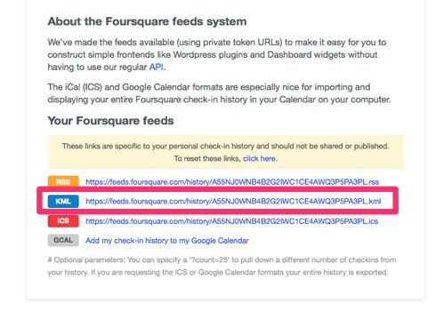

# GeoArchive

One of my longtime interests has been “personal telemetry,” or, in the current vogue, “the quantified self.” Since my early involvement with the Plazes project I’ve had a particular interest in “geopresence” – the record of where I’ve been, when. My breadcrumbs, in other words.

Over the years I’ve been dropping digital breadcrumbs in a variety of ways; for example:

 * 10,973 Plazes check-ins from 2004 to 2012.
 * 2,176 Foursquare check-ins from 2009 to present.
 * 6,245 Google Latitude records from 2010 to present.

I'm building tools to archive and visualize these breadcrumbs, and this PHP class, GeoArchive, is the first of them.

Using GeoArchive you can take [Foursquare](http://foursquare.com) checkins, [Plazes](http://en.wikipedia.org/wiki/Plazes) activities, [Google Latitude](http://en.wikipedia.org/wiki/Google_Latitude) and [Google Location History](https://maps.google.com/locationhistory/b/0) traces, [Openpaths](https://openpaths.cc/) traces, and geolocated [Tweets](http://twitter.com) and [Flickr](http://flickr.com) photos and convert them into standard [GeoJSON](http://geojson.org/).

GeoJSON is easy to parse, and is becoming a *lingua franca* of digital mapping tools: you can visualize GeoJSON files at [geojson.io](http://geojson.io), load them into [QGIS](http://www.qgis.org/en/site/) and [overlay them on Leaflet-powered maps](http://leafletjs.com/examples/geojson.html).

## How To

The PHP class class.geoarchive.php is a Swiss Army knife for turning geolocation archives into GeoJSON. [The code itself is well-documented](docs/index.html); here are the details of how you can get the raw data that the class needs as input:

### Foursquare

* Login to [Foursquare](http://foursquare.com).
* Go to [https://foursquare.com/feeds/](https://foursquare.com/feeds/)
* Grab the URL for the KML feed.



* Append ?count=999999 to the end of the URL. The result will look something like this:

    https://feeds.foursquare.com/history/QNT1EONZ2Q3JLZKXU2E5CNRAG3EOV3GF.kml?count=999999

* Visit this URL in your browser, and save the result as a local file, or use wget, like this:

    wget "https://feeds.foursquare.com/history/QNT1EONZ2Q3JLZKXU2E5CNRAG3EOV3GF.kml?count=999999" -O foursquare.kml

* Pass the path to this local file as the $input_filename parameter, like this:

```php
$foursquare_kml = './foursquare.kml';
require_once 'class.geoarchive.php';
$ga = new GeoArchiveFoursquare('UTC', $foursquare_kml, 'foursquare.geojson');
$ga->processFile();
```


