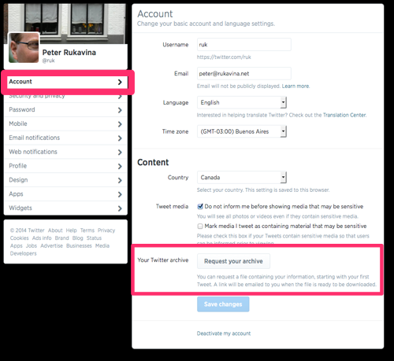
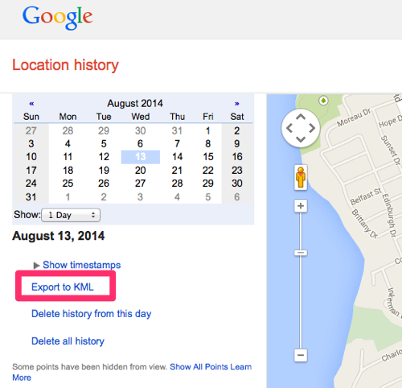
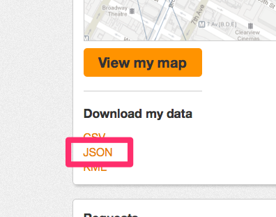

# GeoArchive

One of my [longtime interests](http://hacker.vre.upei.ca/archiving-geopresence) has been “personal telemetry,” or, in the current vogue, “the quantified self.” Since my early involvement with the [Plazes](http://en.wikipedia.org/wiki/Plazes) project I’ve had a particular interest in “geopresence” – the record of where I’ve been, when. My breadcrumbs, in other words.

Over the years I’ve been dropping digital breadcrumbs in a variety of ways; for example:

 * 10,973 Plazes check-ins from 2004 to 2012.
 * 2,176 Foursquare check-ins from 2009 to present.
 * 6,245 Google Latitude records from 2010 to present.

I'm building tools to archive and visualize these breadcrumbs, and this PHP class, GeoArchive, is the first of them.

Using GeoArchive you can take [Foursquare](http://foursquare.com) checkins, [Plazes](http://en.wikipedia.org/wiki/Plazes) activities, [Google Latitude](http://en.wikipedia.org/wiki/Google_Latitude) and [Google Location History](https://maps.google.com/locationhistory/b/0) traces, [Openpaths](https://openpaths.cc/) traces, and geolocated [Tweets](http://twitter.com) and [Flickr](http://flickr.com) photos and convert them into standard [GeoJSON](http://geojson.org/).

GeoJSON is easy to parse, and is becoming a *lingua franca* of digital mapping tools: you can visualize GeoJSON files at [geojson.io](http://geojson.io), load them into [QGIS](http://www.qgis.org/en/site/) and [overlay them on Leaflet-powered maps](http://leafletjs.com/examples/geojson.html).

## How To

The PHP class class.geoarchive.php is a Swiss Army knife for turning geolocation archives into GeoJSON. [The code itself is well-documented](docs/index.html); here are the details of how you can get the raw data that the class needs as input:

### Foursquare

* Login to [Foursquare](http://foursquare.com).
* Go to [https://foursquare.com/feeds/](https://foursquare.com/feeds/)
* Grab the URL for the KML feed.


* Append ?count=999999 to the end of the URL. The result will look something like this:

```
https://feeds.foursquare.com/history/QNT1EONZ2Q3JLZKXU2E5CNRAG3EOV3GF.kml?count=999999
```

* Visit this URL in your browser, and save the result as a local file, or use wget, like this:

```
wget "https://feeds.foursquare.com/history/QNT1EONZ2Q3JLZKXU2E5CNRAG3EOV3GF.kml?count=999999" -O 
foursquare.kml
```

* Pass the path to this local file as the $input_filename parameter, like this:

```php
$foursquare_kml = './foursquare.kml';
require_once 'class.geoarchive.php';
$ga = new GeoArchiveFoursquare('UTC', $foursquare_kml, 'foursquare.geojson');
$ga->processFile();
```

### Plazes

You'll need to have saved an export of your Plazes data from Nokia when this option was made available before the service shutdown.

 * Pass location of the plazes_visited.json from the export as $input_filename_visited.
 * Pass location of the activities_created.json from the export as $input_filename_activities.

Like this:

```php
$plazes_visited = './plazes_visited.json';
$plazes_activities = './activities_created.json';
require_once('class.geoarchive.php');
$ga = new GeoArchivePlazes('UTC', $plazes_visited, $plazes_activities, 'plazes.geojson');
$ga->processFile();
```

### Twitter

Geolocating your tweets is something you need to turn on in your client, so it's possible that either all or none or some of your tweets are geolocated.

 * Request a "Twitter archive" from [https://twitter.com/settings/account](https://twitter.com/settings/account) and then wait until the archive is generated and a link emailed to you.
 
 

 * Unzip the archive.
 * Set the value of $tweet_directory to the directory in the archived that holds JSON files of your tweets -- it's **data/js/tweets** in the ZIP file. Include the trailing slash.
 
```php
$tweet_directory = 'twitter/tweets/data/js/tweets/';
require_once('class.geoarchive.php');
$ga = new GeoArchiveTwitter('UTC', $tweet_directory, 'twitter.geojson');
$ga->processFile();
```

### Google Latitude

Google Latitude no longer operates, so you will need to have requested an archive of your traces before it shut down. Google's Location History service, however, uses the same export format and if you have Location History turned on for your Google account you can request a KML archive as follows:

 * Login to Google.
 * Go to [https://maps.google.ca/locationhistory/b/0/](https://maps.google.ca/locationhistory/b/0/)
 * Grab the URL for the "Export to KML".
 
 
 
 * Change the value of the startTime parameter to 0 - this allows you to get a complete archive, not just 30 days worth; the link will look something like this:
 
```
https://maps.google.ca/locationhistory/b/0/kml?startTime=0&endTime=1407985200000
```

 * Visit this URL in your browser, and save the result as a local file, or use wget, like this:
 
```
wget "https://maps.google.ca/locationhistory/b/0/kml?startTime=0&endTime=1407985200000" -O googlelatitude.kml
```
 
 * Pass path to this local file as the $input_filename parameter.

```php
$google_location_history_kml = './google-latitude-archive.kml';
require_once('class.geoarchive.php');
$ga = new GeoArchiveGoogleLatitude('UTC', $google_location_history_kml, 'googlelatitude.geojson');
$ga->processFile();
```

### Openpaths

 * Login to [Openpaths.cc](http://Openpaths.cc).
 * Under "Download my data", click JSON.
 

 
 * Save the result as a local file.
 * Pass the path to this local file as the $input_filename parameter.

```php 
$openpaths_json = './openpaths_ruk.json';
require_once('class.geoarchive.php');
$ga = new GeoArchiveOpenpaths('UTC', $openpaths_json, '/tmp/openpaths.geojson');
$ga->processFile(); 
```

### Flickr

Depending on your camera, it's possible that some or all of your Flickr photos have geolocation data attached to them.

Right now the process of getting this information out of Flickr is more complicated that it should be, involves some work on your part, and requires Python.

 * You'll need to use the [Open Photos Flickr export script](https://github.com/photo/export-flickr), which is well-documented. Although it's intended to support Open Photos it does exactly what we need: grabs JSON data about Flickr photos.
 * Follow the instructions in the [README](https://github.com/photo/export-flickr/blob/master/Readme.markdown) for that script, but before you run the fetch script, change the reference to `flickr.people_getPhotos` to `photos_getWithGeoData`. Change:

```python 
photos_resp = flickr.people_getPhotos(user_id=user_id, per_page=per_page, page=page, extras='original_format,tags,geo,url_o,url_b,url_c,url_z,date_upload,date_taken,license,description')
```

to this:

```python
photos_resp = photos_getWithGeoData(user_id=user_id, per_page=per_page, page=page, extras='original_format,tags,geo,url_o,url_b,url_c,url_z,date_upload,date_taken,license,description')
```

 * Run the fetch script, then pass the path to the directory where the JSON files were exported as the $flickr_directory parameter. Include the trailing slash.

```php
$flickr_directory = './fetched/';
require_once 'class.geoarchive.php';
$ga = new GeoArchiveFlickr('UTC', $flickr_directory, 'flickr.geojson');
$ga->processFile();
```